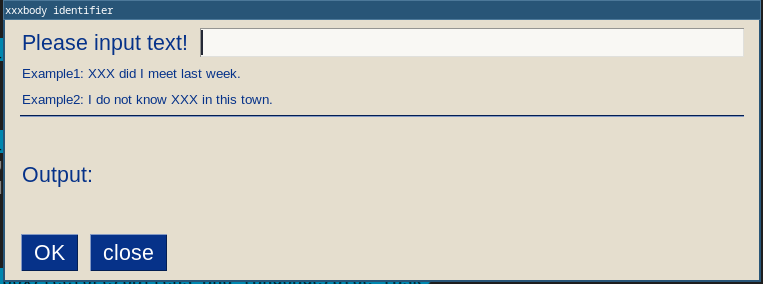

# xxxbody identifier

## ❓ What is this

入力された文の XXX に次の単語のうち、何が入るかを解析してくれます

- anybody
- somebody
- nobody
- everybody

## 🌏 Setup environment

Please install Python.

- [https://www.python.org/downloads/](https://www.python.org/downloads/)

Please install some modules.

```bash
pip install -r requirements.txt
```

## ⛹️ How to use

```bash
python main.py
```


